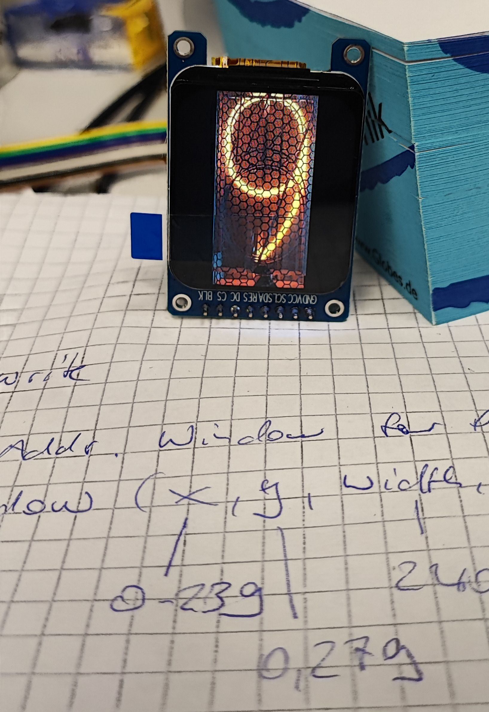
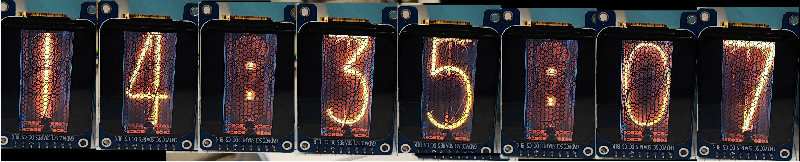
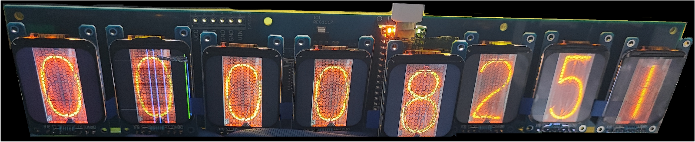

# Bitmap Clock
The idea of an 6-digit (actually eight: six numbers plus two digits showing a blinking separator) Nixie-like clock, using eight 1.69" 280x240 ST7789 IPS LCDs.

It should display the time as hh:mm:ss (eight displays)

Not yet shure if that idea may work at all..
I'm just collecting pieces yet.

## List of components, which may change:
* Arduino Nano ESP32
* RTC DS3231SN
* 8x 1.69" 280x240 ST7789 IPS LCD
* 4x 74LVT244A + 8x 1k pullup resistors for driving eight chip select pins
* REG1117 3.3V
* Implementing or Re-Implementing lib NTPClient? Depends on avail power/space.
* (what else..?)

## Current Status
* design prototype PCB -> done
* produce and assemble prototype -> done
* driving all digits requires takes less than 60% of the avail memory. -> plenty of space left for fun things
* The IPS displays and the RTC should use tiny(!) libs. -> done
* Speed up TFTs as much as possible -> done
* check multiplexing -> done. Found one missing pullup resistor per digit; fixed
* check SPI speed -> done. No problem at all, the default of 32MHz runs nice. Setting it SPI clk to 80MHz doesn't change anything - to be measured.
* 20250223: first successful firmware. IPS displays are actually GREAT in terms of display angle.

## Measured current consumption
* 5V @ 280mA
* This is for running eight displays at max speed, with the RTC idle.
* no need to use the external REG1117

## Display update Time:
* to update all eight digits, we need ~ 0.5sec
* i can save time, if updating only digits, which actually changed their value.

